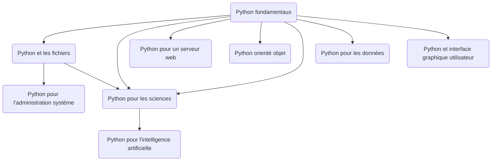
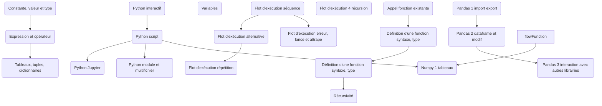

# Programmation en sciences
Repo pour code et organisation du cours 

**SN1** *programmation en sciences*

| Semaine                | Séquence des cours                          | Travaux pratiques           |
|------------------------|---------------------------------------------|-----------------------------|
| [1 →](seances/01.md)   | Intro, plan de cours, premier script        | TP1 : calcul "à la dumb"    |
| [2 →](seances/02.md)   | Valeurs, expressions, types                 | cible 25% fini              |
| [3 →](seances/03.md)   | Structures contrôles                        | cible 50%                   |
| [4 →](seances/04.md)   | Fonctions                                   | 75%                         |
| [5 →](seances/05.md)   | Algorithmique et débogage                   | 100%                        |
| [6 →](seances/06.md)   | Révisions, formatif                         | TP2 : science expérimentale |
| [7 →](seances/07.md)   | **Examen intra**                            | 25%                         |
| [8 →](seances/08.md)   | Fichiers, CSV                               | 50%                         |
| [9 →](seances/09.md)   | Calcul et Numpy, librairie et environnement | 75%                         |
| [10 →](seances/10.md)  | Graphiques et matplotlib                    | 100%                        |
| [11 →](seances/11.md)  | Algorithmique le retour                     | TP3 : à déterminer          |
| [12 →](seances/12.md) | Objet et classes                            | 25%                         |
| [13 →](seances/13.md) | Performance, optimisation parallélisme      | 50%                         |
| [14 →](seances/14.md) | Formatif/révisions. Aperçu Réseaux neurones | 75%                         |
| [15 →](seances/15.md) | **Examen final**                            | 100%                        |

https://mujoco.org/

